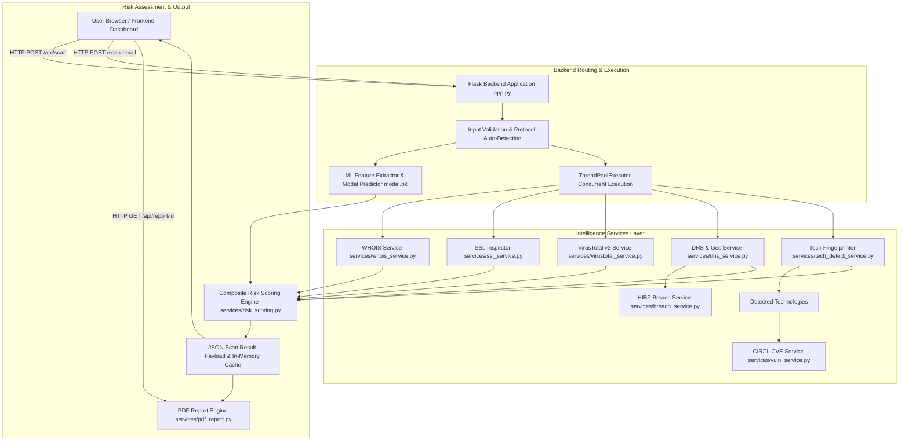

# 🛡️ PhishGuard — Website Intelligence & Security Platform

> **PhishGuard** is an advanced, Flask-based cybersecurity platform that combines Machine Learning URL threat detection, multi-source domain intelligence, SSL/TLS analysis, DNS & hosting analysis, VirusTotal threat scanning, technology stack fingerprinting, vulnerability lookups, data breach checks, email address intelligence, composite risk scoring, and automated PDF security report generation into a unified threat awareness dashboard.

---

## 📑 Table of Contents

1. [Project Overview](#-project-overview)
2. [Features](#-features)
3. [System Architecture](#-system-architecture)
4. [Website Intelligence Workflow](#-website-intelligence-workflow)
5. [Email Intelligence Workflow](#-email-intelligence-workflow)
6. [Technology Stack](#-technology-stack)
7. [Project Structure](#-project-structure)
8. [Module Descriptions](#-module-descriptions)
9. [Machine Learning](#-machine-learning)
10. [API Integrations](#-api-integrations)
11. [Security Verdict](#-security-verdict)
12. [PDF Report Generation](#-pdf-report-generation)
13. [Installation & Setup](#-installation--setup)
14. [Deployment](#-deployment)
15. [Testing & Verification](#-testing--verification)
16. [Limitations](#-limitations)
17. [Future Enhancements](#-future-enhancements)
18. [Conclusion](#-conclusion)
19. [License](#-license)

---

## 📖 Project Overview

Modern phishing and web-based cyberattacks employ sophisticated techniques, including short-lived domain registrations, look-alike domain typosquatting, hidden redirect chains, missing security header configurations, and zero-day malicious link campaigns. Simple static blacklists fail to detect newly registered or dynamically generated phishing URLs.

**PhishGuard** solves this by delivering real-time, multi-layered threat intelligence and automated security audits for any target URL or email address. It aggregates structural Machine Learning predictions with real-world security data from global DNS networks, WHOIS registrars, SSL/TLS handshakes, VirusTotal engines, technology stack fingerprints, the CIRCL CVE Search database, and the Have I Been Pwned breach registry.

Key capabilities include:
- **Comprehensive Website Intelligence**: One-click analysis covering domain age, SSL validity, DNS records, IP geolocation, hosting provider ASN, detected software stack, known vulnerabilities (CVEs), and data breaches.
- **Machine Learning URL Threat Detection**: A Random Forest classifier trained on structural URL parameters to identify suspicious link patterns independently of external blocklists.
- **Email Address Intelligence**: Deep inspection of email addresses to extract username and provider metadata, verify domain creation date, and detect brand typosquatting or character-substitution impersonation attempts.
- **Composite Risk Scoring Engine**: Evaluates 7 distinct security dimensions into a normalized 0–100 risk score with human-readable risk breakdowns and actionable recommendations.
- **Branded PDF Security Reports**: On-demand downloadable security audit reports generated dynamically using ReportLab.

---

## ✨ Features

| Feature | Description |
|---------|-------------|
| 🌐 **Website Intelligence Scanner** | Multi-threaded scan fetching WHOIS, SSL, DNS, VirusTotal, Tech Stack, CVEs, and Data Breaches concurrently for any target URL. |
| 🤖 **ML Phishing Detection** | Random Forest model evaluating 14 structural URL features (length, subdomains, suspicious keywords, shorteners, special characters). |
| 🦠 **VirusTotal Threat Intelligence** | Queries VirusTotal v3 API across 90+ security engines, malware blocklists, and community reputation scores. |
| 🌐 **Domain WHOIS Intelligence** | Retrieves domain registration details, calculates domain age in days, flags newly registered domains (<30 or <90 days), and extracts registrar metadata. |
| 🔒 **SSL Certificate Verification** | Direct socket inspection testing certificate status, issuer/subject common names, validity dates, days remaining, self-signed status, and cipher suites. |
| 🗺️ **DNS & Hosting Geolocation** | Resolves A, AAAA, MX, NS, TXT, SPF, DMARC, CNAME, PTR records and maps server IP geolocation (country, city, ISP, ASN, hosting flag) via ip-api.com. |
| 💻 **Technology Stack Fingerprinting** | Header, cookie, HTML pattern, and meta tag fingerprinting to detect servers (Apache, Nginx), frameworks (React, Angular, Vue, Next.js, Flask, Django), CMS (WordPress), and security controls. |
| ⚠️ **Real-Time Vulnerability Intelligence** | Queries the free CIRCL CVE Search API for recent CVEs affecting detected web technologies, displaying CVSS scores and vulnerability summaries. |
| 🔓 **Data Breach Intelligence** | Queries the Have I Been Pwned API to check if the target domain has been involved in known public data breaches, exposing pwned account counts and data classes. |
| 🚩 **URL Pattern Analysis** | Heuristic rules checking IP-based hostnames, URL shorteners, excessive dashes/subdomains, credential `@` tricks, missing HTTPS, and encoded characters. |
| 📧 **Email Address Intelligence** | Validates email syntax, isolates local username and domain, classifies email providers (public vs. corporate), queries domain age via WHOIS, and detects typo-squatting or character-substitution brand impersonation. |
| ⚖️ **Security Verdict Engine** | Dynamic status verdict (`SAFE`, `SUSPICIOUS`, `HIGH RISK`) with bulleted technical justifications and color-coded risk indicators. |
| 📄 **PDF Security Report Generation** | Generates branded, downloadable multi-page PDF security audit reports formatted with ReportLab. |

---

## 🏗️ System Architecture



---

## 🔄 Website Intelligence Workflow

The Website Intelligence Scanner processes user requests through the following step-by-step pipeline:

```
[User Input URL / Domain]
       │
       ▼
1. Scheme Normalization & Protocol Auto-Detection (TCP port 443 check -> http/https)
       │
       ▼
2. URL Format Validation (Regex match for IPv4, FQDN, TLDs)
       │
       ▼
3. Machine Learning Prediction (Extract 14 URL features -> model.pkl -> Phishing/Safe)
       │
       ▼
4. Concurrent Intelligence Gathering (ThreadPoolExecutor max_workers=5)
       ├─► WHOIS Lookup (python-whois: creation date, age, registrar, country)
       ├─► SSL Certificate Check (socket & ssl: validity, issuer, expiry, self-signed)
       ├─► DNS Resolution (dnspython: A, AAAA, MX, NS, TXT, SPF, DMARC, PTR)
       ├─► Server Geolocation (ip-api.com: country, region, city, ISP, ASN, hosting)
       ├─► VirusTotal Scan (API v3: engine detections, community score, permalink)
       └─► Tech Stack Fingerprinting (headers, cookies, HTML regex patterns)
       │
       ▼
5. Vulnerability & Breach Intelligence (Secondary ThreadPoolExecutor)
       ├─► CIRCL CVE Lookup (cve.circl.lu/api: recent CVEs for matched technologies)
       └─► Have I Been Pwned Check (haveibeenpwned.com/api: domain breach history)
       │
       ▼
6. Protocol & SSL Alignment (Consolidates HTTPS flags across SSL and Tech stack)
       │
       ▼
7. Composite Risk Scoring (calculate_risk_score: 0–100 scale across 7 categories)
       │
       ▼
8. Verdict Generation & Cache (Constructs website_info, verdict status, caches scan result)
       │
       ▼
9. Frontend Dashboard Rendering & PDF Download (Asynchronous JS rendering & ReportLab PDF)
```

---

## 📧 Email Intelligence Workflow

The Email Intelligence Scanner evaluates email addresses for identity markers and impersonation risks:

```
[User Input Email Address]
       │
       ▼
1. Email Syntax Validation & Parsing (parse_email_address)
       ├─ Validates RFC-compliant email structure
       └─ Splits into username (local part) and domain
       │
       ▼
2. Provider Classification
       ├─ Checks domain against PUBLIC_EMAIL_PROVIDERS (Gmail, Yahoo, Outlook, Proton, etc.)
       └─ Maps custom domains to organizational provider names
       │
       ▼
3. Domain Registration Age Lookup
       └─ Calls get_whois_info(domain) to retrieve registration date and age
       │
       ▼
4. Brand Impersonation & Typo-Squatting Detection (detect_typo_squatting)
       ├─ Applies character substitution normalization (0->o, 1->l, vv->w, rn->m, etc.)
       ├─ Compares domain/username against KNOWN_COMPANIES list (Microsoft, PayPal, Apple, etc.)
       └─ Calculates Levenshtein edit distance to flag look-alike impersonation
       │
       ▼
5. HTML Result Page Rendering (email_result.html displaying address, username, provider, creation date)
```

---

## 🛠️ Technology Stack

### Backend Framework & Core
- **Python 3.8+**: Application language.
- **Flask**: Lightweight WSGI web framework and API router.
- **Gunicorn**: Production HTTP server for WSGI deployment.
- **python-dotenv**: Environment variable management.

### Machine Learning & Data Processing
- **scikit-learn**: Random Forest Classifier implementation.
- **NumPy & Pandas**: Data manipulation and feature matrix creation.
- **Pickle**: Model serialization (`model.pkl`).

### Networking, DNS & Security Libraries
- **dnspython**: Asynchronous DNS record resolution (A, AAAA, MX, NS, TXT, PTR).
- **python-whois**: WHOIS record retrieval and parsing.
- **Requests**: HTTP client for external service APIs.
- **Standard `ssl` & `socket`**: Raw TLS handshake inspection and socket connection testing.

### External APIs & Data Providers
- **VirusTotal v3 API**: Multi-engine malware and threat intelligence API.
- **CIRCL CVE Search API**: Open-source vulnerability intelligence (`cve.circl.lu`).
- **Have I Been Pwned (HIBP) API v3**: Public domain breach repository (`haveibeenpwned.com`).
- **ip-api.com**: Server IP geolocation and ASN data provider.

### Document Generation
- **ReportLab**: Programmatic PDF document layout, canvas styling, and flowable tables.

### Frontend & UI
- **HTML5 & CSS3**: Glassmorphic dark design system with custom CSS variables, flexbox/grid layouts, animations, and responsive media queries.
- **Vanilla JavaScript (ES6+)**: Asynchronous API fetching (`fetch`), progress bar animation, dynamic dashboard rendering, DOM manipulation.

---

## 📂 Project Structure

```
webapplication penetration tool/
├── app.py                      # Main Flask application (routes, ML integration, scanner endpoints)
├── config.py                   # Configuration loader (loads .env, API keys, cache TTLs, feature flags)
├── train_model.py              # ML training script (feature extraction, synthetic dataset, model saving)
├── model.pkl                   # Trained Random Forest classifier binary
├── requirements.txt            # Python dependencies
├── Procfile                    # Deployment execution command for Gunicorn
├── .env.example                # Example environment variable template
├── .env                        # Local environment settings (git-ignored)
├── README.md                   # Complete project documentation
│
├── services/                   # Modular backend security services
│   ├── __init__.py             # Package marker
│   ├── whois_service.py        # WHOIS domain age & registrar lookup
│   ├── ssl_service.py          # SSL/TLS certificate verification & cipher inspection
│   ├── virustotal_service.py   # VirusTotal v3 URL scanning & caching engine
│   ├── dns_service.py          # DNS record resolution & IP geolocation lookup
│   ├── tech_detect_service.py  # Tech stack fingerprinting engine
│   ├── risk_scoring.py         # Composite 0–100 risk scoring algorithm
│   ├── vuln_service.py         # CIRCL CVE Search vulnerability lookup service
│   ├── breach_service.py       # Have I Been Pwned data breach intelligence
│   └── pdf_report.py           # ReportLab PDF security report generator
│
├── templates/                  # Jinja2 HTML templates
│   ├── index.html              # Homepage with navigation and feature cards
│   ├── url_scanner.html        # Interactive Website Intelligence Scanner dashboard
│   ├── email_scanner.html      # Email Intelligence input scanner page
│   ├── result.html             # Legacy URL scan result template
│   ├── email_result.html       # Email Intelligence result display page
│   └── help.html               # Help Center, phishing education & security guidelines
│
└── static/                     # Static web assets
    ├── style.css               # Unified glassmorphism cybersecurity stylesheet (~1000 lines)
    └── dashboard.js            # Frontend JavaScript for async API calls & dashboard UI rendering
```

---

## 📦 Module Descriptions

### Core System Files

#### [`app.py`](file:///d:/cybersecurity%20projects/webapplication%20penetration%20tool/app.py)
The central Flask application. Manages model loading, input validation, protocol auto-detection via socket test on port 443, multithreaded scanning orchestrations (`/api/scan`), legacy POST routes (`/scan-url`), email intelligence parsing (`/scan-email`), PDF generation serving (`/api/report/<scan_id>`), and template rendering.

#### [`config.py`](file:///d:/cybersecurity%20projects/webapplication%20penetration%20tool/config.py)
Loads settings from `.env`. Exports `VIRUSTOTAL_API_KEY`, `BUILTWITH_API_KEY`, `SECRET_KEY`, `REQUEST_TIMEOUT`, feature flags (`VIRUSTOTAL_ENABLED`), and scan cache parameters.

#### [`train_model.py`](file:///d:/cybersecurity%20projects/webapplication%20penetration%20tool/train_model.py)
Generates the ML model. Defines the 14-feature extraction logic, builds a dataset of safe and phishing URLs, applies Gaussian noise data augmentation for robustness, fits a `RandomForestClassifier`, and exports `model.pkl`.

---

### Security Services (`services/`)

| Service Module | File Path | Primary Function |
|----------------|-----------|------------------|
| **WHOIS Service** | [`services/whois_service.py`](file:///d:/cybersecurity%20projects/webapplication%20penetration%20tool/services/whois_service.py) | Executes WHOIS queries via `python-whois`, computes domain age in days, extracts registrar, creation/expiration dates, and registrant country. Rejects IP address lookups to prevent hangs. |
| **SSL Service** | [`services/ssl_service.py`](file:///d:/cybersecurity%20projects/webapplication%20penetration%20tool/services/ssl_service.py) | Connects over port 443 using standard Python `ssl` and `socket`. Evaluates certificate validity, common names, expiration date, days remaining, self-signed status, and cipher suite details. |
| **VirusTotal Service** | [`services/virustotal_service.py`](file:///d:/cybersecurity%20projects/webapplication%20penetration%20tool/services/virustotal_service.py) | Connects to VirusTotal v3 API. Features local API key format validation, URL submission, polling with exponential back-off, response caching (10 min TTL), engine detection parsing, and detailed error mapping (`NO_API_KEY`, `INVALID_KEY`, `RATE_LIMITED`). |
| **DNS & Hosting Service** | [`services/dns_service.py`](file:///d:/cybersecurity%20projects/webapplication%20penetration%20tool/services/dns_service.py) | Resolves DNS record types (A, AAAA, MX, NS, TXT, SPF, DMARC, CNAME, PTR) concurrently. Queries `ip-api.com` for IP geolocation, ISP, ASN, and datacenter hosting detection. |
| **Tech Detection Service** | [`services/tech_detect_service.py`](file:///d:/cybersecurity%20projects/webapplication%20penetration%20tool/services/tech_detect_service.py) | Fingerprints technologies using HTTP response headers (`Server`, `X-Powered-By`), cookies, meta generator tags, and regular expressions against response HTML (detecting Web Servers, CMS, JS Frameworks, Analytics, Security controls). |
| **Vulnerability Service** | [`services/vuln_service.py`](file:///d:/cybersecurity%20projects/webapplication%20penetration%20tool/services/vuln_service.py) | Maps detected technologies to vendor/product identifiers and queries the public CIRCL CVE Search API for recent vulnerabilities, extracting CVE IDs, CVSS ratings, and summaries. |
| **Data Breach Service** | [`services/breach_service.py`](file:///d:/cybersecurity%20projects/webapplication%20penetration%20tool/services/breach_service.py) | Queries Have I Been Pwned API v3 (`breaches?domain=`) to fetch public data breach records associated with a domain, exposing breach date, pwn count, description, and compromised data categories. |
| **Risk Scoring Engine** | [`services/risk_scoring.py`](file:///d:/cybersecurity%20projects/webapplication%20penetration%20tool/services/risk_scoring.py) | Calculates a composite 0–100 risk score weighted across 7 categories (ML prediction, domain age, SSL status, VirusTotal, URL patterns, DNS anomalies, redirect behavior) and generates recommendations. |
| **PDF Report Generator** | [`services/pdf_report.py`](file:///d:/cybersecurity%20projects/webapplication%20penetration%20tool/services/pdf_report.py) | Formats scan results into a branded PDF report using ReportLab with tables, risk scores, certificate details, threat detections, and disclaimer footers. |

---

## 🤖 Machine Learning

### Model Parameters

- **Classifier**: `sklearn.ensemble.RandomForestClassifier`
- **Trees (`n_estimators`)**: 100
- **Max Depth (`max_depth`)**: 10
- **Class Weighting**: `class_weight='balanced'`
- **Random Seed**: 42

### Feature Vector Specification (14 Numeric Features)

```python
features = [
    len(url),                                        # 0: Total URL length
    url_lower.count('.'),                            # 1: Dot count
    url_lower.count('-'),                            # 2: Hyphen count
    url_lower.count('@'),                            # 3: '@' symbol count
    url_lower.count('//'),                           # 4: Double-slash count
    1 if 'https' in url_lower else 0,                # 5: HTTPS protocol flag
    1 if digits_in_domain else 0,                    # 6: Numeric digits in domain
    sum(1 for kw in SUSPICIOUS_KEYWORDS if kw in url_lower), # 7: Suspicious keyword count
    1 if shortener_detected else 0,                  # 8: Shortener domain flag
    url_lower.count('/'),                            # 9: Slash count
    url_lower.count('?'),                            # 10: Query parameter count
    url_lower.count('='),                            # 11: Equals sign count
    len(domain),                                     # 12: Domain length
    1 if dot_count > 4 else 0,                       # 13: Excessive subdomains flag
]
```

### Dataset & Training Process
- Seed URLs: 40 verified safe URLs + 40 known phishing URLs.
- Data Augmentation: Features are expanded using normal noise augmentation (`rng.normal(0, 0.5)`), yielding 160 training vectors for generalized decision boundary learning.
- Runtime Execution: `app.py` passes extracted URL features to `model.predict()` during each scan invocation.

---

## 🔌 API Integrations

### 1. VirusTotal v3 API
- **Endpoint**: `https://www.virustotal.com/api/v3/urls` & `/analyses/{id}`
- **Authentication**: `x-apikey` header.
- **Data Extracted**: Malicious/suspicious/harmless/undetected counts, total engine count, community reputation score, scan timestamp, permalink, and per-engine detection names.

### 2. WHOIS Protocol / Registry
- **Implementation**: `python-whois` library querying TLD port 43 WHOIS servers.
- **Data Extracted**: Domain creation, expiration, and update dates; domain age in days; registrar name; registrant country; organization name; status codes.

### 3. Native SSL/TLS Inspection
- **Implementation**: Python standard library `ssl` and `socket`.
- **Data Extracted**: Certificate validity status (`valid`, `expired`, `self_signed`, `invalid`, `no_ssl`), issuer CN/organization, subject CN, valid from/to timestamps, days remaining, Subject Alternative Names (SAN), signature algorithms.

### 4. DNS & IP Geolocation API
- **Implementation**: `dnspython` library + `http://ip-api.com/json/{ip}`
- **Data Extracted**: A, AAAA, MX (priorities + hosts), NS, TXT, SPF, DMARC, CNAME, reverse DNS PTR records; IP geolocation (country, region, city, ISP, organization, ASN, hosting flag).

### 5. Technology Stack Detection (Heuristic Engine)
- **Implementation**: Native HTTP requests + Header parsing + Cookie analysis + Meta tag extraction + HTML pattern matching.
- **Data Extracted**: Categorized software components (Web Servers, CMS, JS Frameworks, CSS Frameworks, JS Libraries, Analytics, Security controls).

### 6. CIRCL CVE Search API
- **Endpoint**: `https://cve.circl.lu/api/search/{vendor}/{product}`
- **Authentication**: None required (free public API).
- **Data Extracted**: Top recent CVE IDs, CVSS vulnerability severity ratings, publication dates, and summary descriptions.

### 7. Have I Been Pwned (HIBP) API
- **Endpoint**: `https://haveibeenpwned.com/api/v3/breaches?domain={domain}`
- **Authentication**: None required for domain-level breach listing.
- **Data Extracted**: Breach titles, breach dates, account compromise counts, descriptions, verification flags, and exposed data categories (passwords, emails, IP addresses).

---

## ⚖️ Security Verdict

PhishGuard features a dual-layer risk evaluation mechanism combining quantitative composite scoring and categorical rule-based verdict logic:

### Composite Risk Score (0–100 Scale)

```
Total Risk Score = ML Score (max 25)
                 + Domain Age Score (max 15)
                 + SSL Certificate Score (max 15)
                 + VirusTotal Score (max 20)
                 + URL Pattern Score (max 10)
                 + DNS Anomaly Score (max 10)
                 + Redirect Behavior Score (max 5)
```

| Total Score Range | Risk Level | Description |
|-------------------|------------|-------------|
| **76 – 100** | **Critical Risk** | Extremely high threat probability. Multiple malicious indicators detected. |
| **51 – 75** | **High Risk** | Significant risk factors present. URL should be treated as dangerous. |
| **26 – 50** | **Medium Risk** | Moderate risk indicators found. Exercise caution before proceeding. |
| **0 – 25** | **Low Risk** | No significant threats detected. Domain appears legitimate. |

### Frontend Final Security Verdict Rules

The frontend (`static/dashboard.js`) evaluates findings to assign a visual status banner:
- **`HIGH RISK`** (Red): Assigned if VirusTotal detects >0 malicious engines, SSL status is invalid/expired, OR 2+ suspicious indicators exist.
- **`SUSPICIOUS`** (Amber): Assigned if URL shorteners, newly registered domains (<90 days), missing SPF, missing DMARC, or suspicious VT flags are present.
- **`SAFE`** (Green): Assigned when zero VirusTotal detections occur, SSL certificate is valid, HTTPS is active, domain age is established, and SPF/DMARC records are verified.

---

## 📄 PDF Report Generation

PhishGuard provides on-demand downloadable security audit reports generated via ReportLab (`services/pdf_report.py`):

1. **Trigger**: Clicking **"Download PDF Report"** calls `/api/report/<scan_id>`.
2. **Data Source**: Fetches the cached JSON scan result dictionary stored during `/api/scan`.
3. **Document Layout**:
   - Branded header banner with report title and timestamp.
   - Analyzed URL and domain metadata.
   - Structured WHOIS table (registrar, creation/expiration, age, country).
   - SSL Certificate table (issuer, subject, status, algorithm, days remaining).
   - VirusTotal Threat breakdown and detection engine table.
   - DNS & Hosting records (IPs, NS, MX, SPF, DMARC, Geolocation).
   - Detected Technology Stack table categorized by software layer.
   - URL Pattern findings bullet points.
   - Educational cybersecurity disclaimer footer.

---

## 🚀 Installation & Setup

### Prerequisites
- **Python 3.8+**
- **pip** package manager

### Step-by-Step Installation

1. **Clone the Repository**:
   ```bash
   git clone <repository-url>
   cd "webapplication penetration tool"
   ```

2. **Create and Activate a Virtual Environment**:
   ```bash
   # Windows (PowerShell)
   python -m venv venv
   .\venv\Scripts\activate

   # Linux / macOS
   python3 -m venv venv
   source venv/bin/activate
   ```

3. **Install Dependencies**:
   ```bash
   pip install -r requirements.txt
   ```

4. **Environment Configuration**:
   Copy `.env.example` to `.env` and configure optional keys:
   ```bash
   cp .env.example .env
   ```
   Edit `.env`:
   ```env
   VIRUSTOTAL_API_KEY=your_virustotal_api_key_here
   SECRET_KEY=phishguard-dev-secret-key
   REQUEST_TIMEOUT=10
   ```

5. **Train or Verify the ML Model**:
   If `model.pkl` is missing, generate it by running:
   ```bash
   python train_model.py
   ```

6. **Start the Flask Application**:
   ```bash
   python app.py
   ```

7. **Access the Application**:
   Open browser at `http://127.0.0.1:5000`

---

## 🌐 Deployment

PhishGuard is production-ready for WSGI server environments and cloud PaaS platforms like Render, Heroku, or AWS:

### WSGI Execution with Gunicorn
The repository includes a `Procfile` configured for Gunicorn:
```
web: gunicorn app:app
```

### Manual Production Launch
```bash
gunicorn --bind 0.0.0.0:5000 --workers 4 app:app
```

---

## 🧪 Testing & Verification

### 1. Website Intelligence Scanner Test

Execute a POST request to `/api/scan`:
```bash
curl -X POST http://127.0.0.1:5000/api/scan \
     -H "Content-Type: application/json" \
     -d '{"url": "google.com"}'
```
*Expected Result*: HTTP 200 JSON object containing `scan_id`, `ml_analysis`, `whois`, `ssl`, `virustotal`, `dns`, `technologies`, `vulnerabilities`, `breach_info`, `risk_score`, and `website_info`.

### 2. Email Intelligence Test

Execute a POST request to `/scan-email`:
```bash
curl -X POST http://127.0.0.1:5000/scan-email \
     -d "email_address=microsoft@gmail.com"
```
*Expected Result*: HTTP 200 HTML response displaying username (`microsoft`), provider (`Google Gmail`), and domain creation date.

### 3. PDF Report Generation Test
```bash
curl -o report.pdf http://127.0.0.1:5000/api/report/<scan_id>
```
*Expected Result*: Valid downloadable PDF document containing formatted security report tables.

---

## ⚠️ Limitations

1. **VirusTotal API Rate Limits**: The free VirusTotal API key tier imposes a limit of 4 requests/minute and 500 requests/day.
2. **WHOIS IP Lookups**: The WHOIS service explicitly rejects IP address inputs as raw TLD WHOIS services require domain names.
3. **In-Memory Scan Cache**: Scan results used for PDF generation are stored in an in-memory dictionary capped at 100 entries (`SCAN_CACHE_MAX_SIZE`), resetting on application restart.
4. **Synthetic ML Training Dataset**: The ML model is trained on a synthetic dataset of 80 seed URLs (augmented to 160 samples); accuracy can be further expanded using larger real-world PhishTank datasets.

---

## 🔮 Future Enhancements

- **Persistent Database Integration**: Implement PostgreSQL / SQLite storage to persist scan histories, report archives, and user analytics.
- **Live Website Screenshotting**: Integrate headless Chromium/Playwright to capture real-time visual screenshots of target URLs.
- **PhishTank & OpenPhish Live Feeds**: Connect real-time zero-day phishing feeds directly into the risk engine.
- **Browser Extension**: Build a Chrome/Firefox extension leveraging `/api/scan` for real-time browsing protection.

---

## 📝 Conclusion

**PhishGuard** delivers a comprehensive, production-ready website intelligence and threat detection platform. By combining structural Machine Learning URL classification with real-time domain WHOIS, SSL inspection, multi-engine VirusTotal scans, DNS record resolution, IP geolocation, technology stack detection, CVE vulnerability tracking, and HIBP breach analysis, PhishGuard provides actionable cybersecurity visibility for both security practitioners and end users.

---

## 📄 License

This project is licensed under the **MIT License**.
